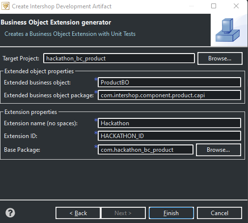

# hackathon2301-business-object-extension-wizard
## Quick creation of business object extensions through the Intershop Studio

The code available in this repository will enable the creation of simple Business Object Extensions in Intershop Studio through an easy to use wizard. 

## Features

- Creates all the boiler plate files to setup a new Business Object Extension
- Unit tests are automatically created

## Installation

Simply place the `businessObjectExtension` folder in your server, under `server\share\system\cartridges\core\release\generationTemplates\`.

## Usage
Through the following screenshots you can see how the Business Object Extension creation wizard is used.

